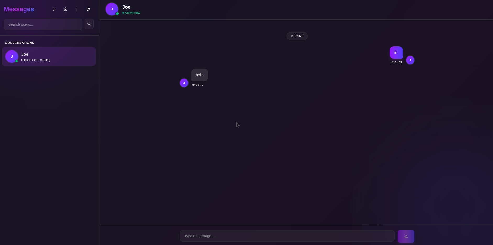
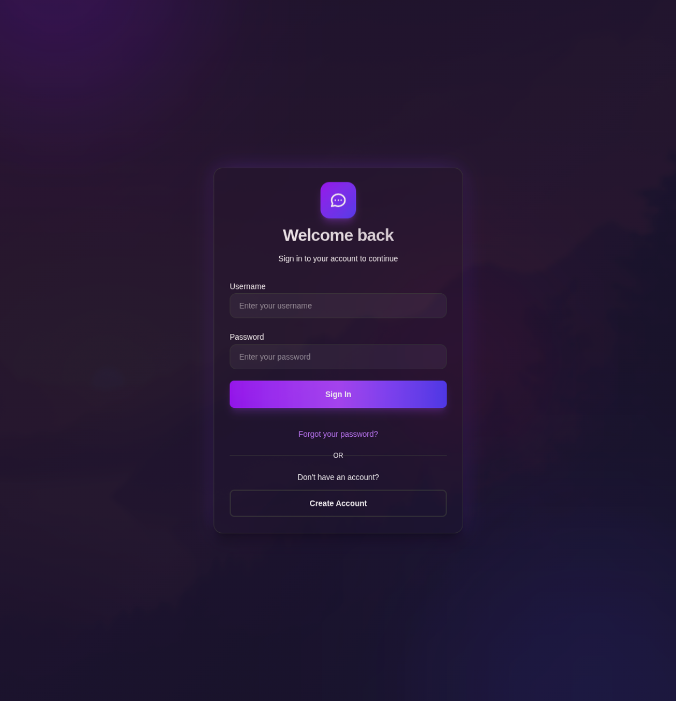
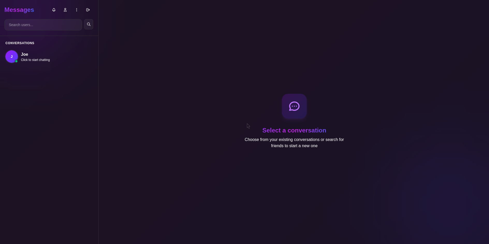

# Chat Application

A modern real-time chat application built with React, Node.js, Socket.IO, and MySQL.



## Features

- **Real-time Messaging** — Instant message delivery using WebSocket connections
- **User Authentication** — Secure JWT-based authentication with password hashing
- **User Profiles** — Customizable profiles with avatars and personal notes
- **User Search** — Find and connect with other users
- **Message Notifications** — Unread message counters and notifications
- **Spam Management** — Block unwanted users and manage spam
- **Password Recovery** — Email-based password reset functionality
- **Responsive Design** — Works seamlessly on desktop and mobile devices

## Screenshots

### Login



### Dashboard



### Chat


## Tech Stack

### Frontend
- React 19
- React Router DOM
- Socket.IO Client
- Tailwind CSS
- Radix UI Components

### Backend
- Node.js with Express
- Socket.IO
- MySQL
- JWT Authentication
- Bcrypt for password hashing
- Multer for file uploads
- Nodemailer for emails

### Infrastructure
- Docker & Docker Compose
- Nginx reverse proxy

## Getting Started

### Prerequisites

- Node.js 18+
- MySQL 8.0+
- Docker (optional)

### Local Development

1. **Clone the repository**
   ```bash
   git clone https://github.com/yourusername/chat_app.git
   cd chat_app
   ```

2. **Install dependencies**
   ```bash
   npm install
   ```

3. **Set up environment variables**
   ```bash
   cp .env.example .env
   # Edit .env with your database credentials
   ```

4. **Initialize the database**
   ```bash
   mysql -u root -p < init/schema.sql
   ```

5. **Start the development server**
   ```bash
   npm run dev
   ```

### Docker Deployment

```bash
docker-compose up --build
```

The application will be available at `http://localhost`.

## API Endpoints

### Authentication

| Method | Endpoint | Description |
|--------|----------|-------------|
| POST | `/register` | Create a new user account |
| POST | `/login` | Authenticate and get JWT token |
| POST | `/refresh-token` | Refresh an expired token |
| POST | `/reset-password` | Request password reset email |
| POST | `/reset-password/:token` | Reset password with token |

### Users

| Method | Endpoint | Description |
|--------|----------|-------------|
| GET | `/profile/:id` | Get user profile by ID |
| PUT | `/update-profile` | Update user profile |
| GET | `/search-users` | Search users by username |

### Chat

| Method | Endpoint | Description |
|--------|----------|-------------|
| GET | `/direct-chats` | Get all user's conversations |
| POST | `/create-user-chatroom` | Create or get chat room with user |
| GET | `/user-messages/:chat_room_id` | Get messages for a chat room |
| POST | `/mark-messages-read` | Mark messages as read |
| GET | `/unread-messages` | Get unread message counts |

### Notifications & Spam

| Method | Endpoint | Description |
|--------|----------|-------------|
| GET | `/notifications` | Get pending chat requests |
| POST | `/accept-user` | Accept a chat request |
| POST | `/decline-user` | Decline and mark as spam |
| GET | `/spam-chats` | Get spam chat list |
| POST | `/unspam` | Remove user from spam |

## WebSocket Events

### Client → Server

| Event | Payload | Description |
|-------|---------|-------------|
| `joinRoom` | `chat_room_id` | Join a chat room |
| `chatMessage` | `{ chat_room_id, user_id, username, message }` | Send a message |

### Server → Client

| Event | Payload | Description |
|-------|---------|-------------|
| `New_message` | `{ chat_room_id, user_id, username, message, sent_at }` | New message received |

## Database Schema

The application uses MySQL with the following tables:

### Entity Relationship Diagram

```
┌─────────────────┐     ┌─────────────────┐     ┌─────────────────┐
│     users       │     │   chatrooms     │     │    messages     │
├─────────────────┤     ├─────────────────┤     ├─────────────────┤
│ id (PK)         │◄──┐ │ id (PK)         │◄──┐ │ id (PK)         │
│ username        │   │ │ name            │   │ │ chat_room_id(FK)│──►
│ email           │   │ │ created_at      │   │ │ user_id (FK)    │──►
│ password        │   │ └─────────────────┘   │ │ message         │
│ name            │   │                       │ │ sent_at         │
│ surname         │   │ ┌─────────────────┐   │ │ is_read         │
│ note            │   │ │ userchatrooms   │   │ └─────────────────┘
│ avatar          │   │ ├─────────────────┤   │
│ created_at      │   │ │ chat_room_id(FK)│───┘
└─────────────────┘   │ │ user_id (FK)    │───┐
         │            │ └─────────────────┘   │
         │            └───────────────────────┘
         │
         │  ┌─────────────────┐     ┌─────────────────┐
         │  │ accepted_users  │     │   spam_users    │
         │  ├─────────────────┤     ├─────────────────┤
         ├─►│ user_id (FK)    │     │ user_id (FK)    │◄─┐
         │  │ accepted_user_id│◄─┐  │ spam_user_id(FK)│──┘
         │  │ accepted_at     │  │  │ created_at      │
         │  └─────────────────┘  │  └─────────────────┘
         │                       │
         └───────────────────────┘
```

### Tables

#### `users`
Stores user account information.

| Column | Type | Description |
|--------|------|-------------|
| `id` | INT (PK) | Unique user identifier |
| `username` | VARCHAR(50) | Unique username |
| `email` | VARCHAR(100) | Unique email address |
| `password` | VARCHAR(255) | Bcrypt hashed password |
| `name` | VARCHAR(50) | First name |
| `surname` | VARCHAR(50) | Last name |
| `note` | TEXT | User's personal note/bio |
| `avatar` | VARCHAR(255) | Path to avatar image |
| `created_at` | TIMESTAMP | Account creation date |

#### `chatrooms`
Stores chat room metadata.

| Column | Type | Description |
|--------|------|-------------|
| `id` | INT (PK) | Unique chat room identifier |
| `name` | VARCHAR(100) | Chat room name |
| `created_at` | TIMESTAMP | Room creation date |

#### `userchatrooms`
Junction table linking users to chat rooms (many-to-many).

| Column | Type | Description |
|--------|------|-------------|
| `chat_room_id` | INT (FK) | Reference to chatrooms.id |
| `user_id` | INT (FK) | Reference to users.id |

#### `messages`
Stores all chat messages.

| Column | Type | Description |
|--------|------|-------------|
| `id` | INT (PK) | Unique message identifier |
| `chat_room_id` | INT (FK) | Reference to chatrooms.id |
| `user_id` | INT (FK) | Sender's user ID |
| `message` | TEXT | Message content |
| `sent_at` | TIMESTAMP | When message was sent |
| `is_read` | BOOLEAN | Read status |

#### `accepted_users`
Tracks accepted friend/chat requests.

| Column | Type | Description |
|--------|------|-------------|
| `user_id` | INT (FK) | The accepting user |
| `accepted_user_id` | INT (FK) | The accepted user |
| `accepted_at` | TIMESTAMP | When accepted |

#### `spam_users`
Tracks blocked/spam users.

| Column | Type | Description |
|--------|------|-------------|
| `user_id` | INT (FK) | The blocking user |
| `spam_user_id` | INT (FK) | The blocked user |
| `created_at` | TIMESTAMP | When blocked |

#### `password_resets`
Stores password reset tokens.

| Column | Type | Description |
|--------|------|-------------|
| `id` | INT (PK) | Unique identifier |
| `email` | VARCHAR(100) | User's email |
| `token` | VARCHAR(255) | Reset token |
| `created_at` | TIMESTAMP | Token creation time |

## Project Structure

```
chat_app/
├── src/
│   ├── backend/
│   │   ├── server.js       # Express server & Socket.IO
│   │   ├── db.js           # MySQL connection
│   │   └── email.js        # Email service
│   ├── components/
│   │   ├── ui/             # Reusable UI components
│   │   ├── DirectChats.jsx # Main chat interface
│   │   ├── Login.jsx       # Login form
│   │   ├── Register.jsx    # Registration form
│   │   ├── Profile.jsx     # User profile
│   │   └── ...
│   ├── services/
│   │   └── api.js          # API client functions
│   ├── utils/
│   │   └── formatters.js   # Utility functions
│   ├── config/
│   │   └── api.js          # API configuration
│   ├── App.jsx             # Root component
│   ├── main.jsx            # Entry point
│   └── index.css           # Global styles
├── init/
│   └── schema.sql          # Database schema
├── uploads/                # User uploaded files
├── docker-compose.yml      # Docker configuration
├── Dockerfile.frontend     # Frontend container
├── Dockerfile.backend      # Backend container
└── nginx.conf              # Nginx configuration
```

## Environment Variables

| Variable | Description | Default |
|----------|-------------|---------|
| `VITE_API_URL` | Backend API URL | `http://localhost:3000` |
| `VITE_API_SOCKET_URL` | WebSocket URL | `http://localhost:3000` |
| `VITE_API_DB_HOST` | MySQL host | `localhost` |
| `VITE_API_DB_USER` | MySQL username | — |
| `VITE_API_DB_PASSWORD` | MySQL password | — |
| `VITE_API_DB_NAME` | Database name | — |
| `VITE_API_JWT_SECRET` | JWT signing secret | — |
| `VITE_API_PORT` | Backend port | `3000` |

## License

MIT License
